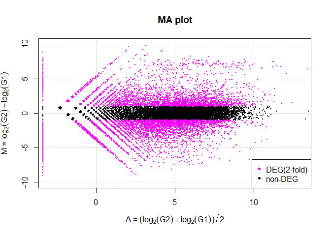

解析 | 発現変動 | 2群間 | 対応なし | 複製あり | TCC(Sun\_2013)
================
Kadota, Su
2018年4月30日

リファレンス：[解析 | 発現変動 | 2群間 | 対応なし | 複製あり |
TCC(Sun\_2013)](www.iu.a.u-tokyo.ac.jp/~kadota/r_seq.html#analysis_deg_2_unpaired_ari_TCC)

[TCC](http://bioconductor.org/packages/release/bioc/html/TCC.html)を用いたやり方を示します。
内部的に[iDEGES/edgeR(Sun\_2013)](http://www.iu.a.u-tokyo.ac.jp/~kadota/r_seq.html#normalization_inter_2_ari_iDEGESedgeR)正規化を実行したのち、
[edgeR](http://bioconductor.org/packages/release/bioc/html/edgeR.html)パッケージ中のexact
testで発現変動遺伝子(Differentially expressed Genes;
DEGs)検出を行っています。TCC原著論文中のiDEGES/edgeR-edgeRという解析パイプラインに相当します。
全て[TCC](http://bioconductor.org/packages/release/bioc/html/TCC.html)パッケージ([Sun
et al., BMC
Bioinformatics, 2013](http://www.ncbi.nlm.nih.gov/pubmed/23837715))内で完結します。
「ファイル」−「ディレクトリの変更」で解析したいファイルを置いてあるディレクトリに移動し以下をコピペ。

## 1\. サンプルデータ13の10,000 genes × 6 samplesの[カウントデータ](http://www.iu.a.u-tokyo.ac.jp/~kadota/R_seq/data_hypodata_3vs3.txt)の場合：

-----

Biological replicatesを模倣したシミュレーションデータ(G1群3サンプル vs. G2群3サンプル)です。
gene\_1〜gene\_2000までがDEG (最初の1800個がG1群で高発現、残りの200個がG2群で高発現)
gene\_2001〜gene\_10000までがnon-DEGであることが既知です。

### 0\. 必要なパッケージをロード

``` r
libs <- c("knitr", "dplyr", "caret", "devtools", "plotly")
for (i in libs){
  if( !is.element(i, .packages(all.available = TRUE)) ) {
    install.packages(i)
  }
  library(i,character.only = TRUE)
}

# TCC及びROCパッケージはCRANにいないため、インストールされていない場合は下記のコードを実行してインストールしてください。
# source("https://bioconductor.org/biocLite.R")
# biocLite("TCC")
# biocLite("ROC")

library(ROC)
```

> 2018年4月の時点で、TCCパッケージをロードする時に、samrパッケージを先にロードする必要があります。しかし、CRANにあるsamrパッケージはR-3.0.0ではインストールできない状態になっている。予備の方法の一つとして、著者がGithubにアップロードしたsamrをインストールしかない。更に、samrが必要となりimputeパッケージもCRANに除外され、Bioconductor経由でインストールします。

``` r
# 下記のコードを実行すると別のツールのインストールも必要されているかもしれません
# install_github("bnaras/samr")　　#メモ

# 下記のコードも使えない、CRANに除外されましたので、Bioconductorでインストールする
# install.packages("impute")  　　#メモ
# source("https://bioconductor.org/biocLite.R")
# biocLite("impute")

# もう一回samrをインストールしてみる
# install_github("bnaras/samr")

library(TCC)
```

これで、修復完了です。

### 1\. 設置及びファイルの読み込み

``` r
in_f <- "http://www.iu.a.u-tokyo.ac.jp/~kadota/R_seq/data_hypodata_3vs3.txt"
# out_f1 <- "hoge1.txt"                  #出力ファイル名を指定してout_f1に格納
# out_f2 <- "hoge1.png"                  #出力ファイル名を指定してout_f2に格納
param_G1 <- 3                          #G1群のサンプル数を指定
param_G2 <- 3                          #G2群のサンプル数を指定
param_FDR <- 0.05                      #false discovery rate (FDR)閾値を指定
# param_fig <- c(400, 380)               #ファイル出力時の横幅と縦幅を指定(単位はピクセル)

#入力ファイルの読み込み
data <- read.table(in_f, 
                   header=TRUE, 
                   row.names=1, 
                   sep="\t", 
                   quote="")           #in_fで指定したファイルの読み込み

kable(head(data, n=10))
```

|          | G1\_rep1 | G1\_rep2 | G1\_rep3 | G2\_rep1 | G2\_rep2 | G2\_rep3 |
| -------- | -------: | -------: | -------: | -------: | -------: | -------: |
| gene\_1  |       36 |       56 |      144 |        2 |        1 |        0 |
| gene\_2  |       84 |      152 |      124 |       52 |       37 |       28 |
| gene\_3  |      592 |      840 |      800 |      151 |      257 |      200 |
| gene\_4  |        0 |        8 |        4 |        1 |        1 |        3 |
| gene\_5  |       32 |       32 |        0 |        1 |        1 |        0 |
| gene\_6  |        4 |        0 |       24 |        4 |       10 |        0 |
| gene\_7  |      344 |      240 |      236 |       76 |       67 |       71 |
| gene\_8  |     1264 |      784 |     1060 |      212 |      183 |      179 |
| gene\_9  |       92 |       88 |       84 |       21 |       22 |       33 |
| gene\_10 |       64 |       48 |       96 |       24 |       13 |       12 |

### 2\. 前処理

TCCクラスオブジェクトの作成する。

``` r
#G1群を1、G2群を2としたベクトルdata.clを作成
data.cl <- c(rep(1, param_G1), rep(2, param_G2))
data.cl
```

    ## [1] 1 1 1 2 2 2

``` r
#TCCクラスオブジェクトtccを作成
tcc <- new("TCC", data, data.cl)       
```

### 3\. 正規化

``` r
#正規化を実行した結果をtccに格納
tcc <- calcNormFactors(tcc, 
                       norm.method="tmm",
                       test.method="edger",
                       iteration=3, 
                       FDR=0.1, 
                       floorPDEG=0.05)
tcc
```

    ## Count:
    ##        G1_rep1 G1_rep2 G1_rep3 G2_rep1 G2_rep2 G2_rep3
    ## gene_1      36      56     144       2       1       0
    ## gene_2      84     152     124      52      37      28
    ## gene_3     592     840     800     151     257     200
    ## gene_4       0       8       4       1       1       3
    ## gene_5      32      32       0       1       1       0
    ## gene_6       4       0      24       4      10       0
    ## 
    ## Sample:
    ##         group norm.factors lib.sizes
    ## G1_rep1     1    0.7475138   1317378
    ## G1_rep2     1    0.8360228   1305247
    ## G1_rep3     1    0.7245591   1317282
    ## G2_rep1     2    1.2546831   1284225
    ## G2_rep2     2    1.1885056   1278316
    ## G2_rep3     2    1.2487157   1283690
    ## 
    ## DEGES:
    ##    Pipeline       : tmm - [ edger - tmm ] X 3
    ##    Execution time : 10.0 sec
    ##    Threshold type : FDR < 0.10
    ##    Potential PDEG : 0.13

### 4\. DEG検出

``` r
tcc <- estimateDE(tcc, 
                  test.method="edger",
                  FDR=param_FDR)       #DEG検出を実行した結果をtccに格納
tcc
```

    ## Count:
    ##        G1_rep1 G1_rep2 G1_rep3 G2_rep1 G2_rep2 G2_rep3
    ## gene_1      36      56     144       2       1       0
    ## gene_2      84     152     124      52      37      28
    ## gene_3     592     840     800     151     257     200
    ## gene_4       0       8       4       1       1       3
    ## gene_5      32      32       0       1       1       0
    ## gene_6       4       0      24       4      10       0
    ## 
    ## Sample:
    ##         group norm.factors lib.sizes
    ## G1_rep1     1    0.7475138   1317378
    ## G1_rep2     1    0.8360228   1305247
    ## G1_rep3     1    0.7245591   1317282
    ## G2_rep1     2    1.2546831   1284225
    ## G2_rep2     2    1.1885056   1278316
    ## G2_rep3     2    1.2487157   1283690
    ## 
    ## DEGES:
    ##    Pipeline       : tmm - [ edger - tmm ] X 3
    ##    Execution time : 10.0 sec
    ##    Threshold type : FDR < 0.10
    ##    Potential PDEG : 0.13
    ## 
    ## Results:
    ##   gene_id  a.value    m.value      p.value      q.value rank estimatedDEG
    ## 1  gene_1 3.148234 -6.2619295 1.770125e-10 1.180084e-07   15            1
    ## 2  gene_2 6.096777 -1.5881518 6.522985e-04 7.247761e-03  900            1
    ## 3  gene_3 8.601768 -1.8414834 2.890078e-06 6.784221e-05  426            1
    ## 4  gene_4 1.370464 -1.2335151 4.808686e-01 1.000000e+00 4523            0
    ## 5  gene_5 1.916709 -4.9665865 3.272844e-03 3.087588e-02 1060            1
    ## 6  gene_6 2.721477 -0.9585627 5.542648e-01 1.000000e+00 5047            0

``` r
result <- getResult(tcc, sort=FALSE)   #p値などの計算結果をresultに格納
kable(head(result, n=10))
```

| gene\_id |  a.value |     m.value |   p.value |   q.value | rank | estimatedDEG |
| :------- | -------: | ----------: | --------: | --------: | ---: | -----------: |
| gene\_1  | 3.148234 | \-6.2619295 | 0.0000000 | 0.0000001 |   15 |            1 |
| gene\_2  | 6.096777 | \-1.5881518 | 0.0006523 | 0.0072478 |  900 |            1 |
| gene\_3  | 8.601768 | \-1.8414834 | 0.0000029 | 0.0000678 |  426 |            1 |
| gene\_4  | 1.370464 | \-1.2335151 | 0.4808686 | 1.0000000 | 4523 |            0 |
| gene\_5  | 1.916709 | \-4.9665865 | 0.0032728 | 0.0308759 | 1060 |            1 |
| gene\_6  | 2.721477 | \-0.9585627 | 0.5542648 | 1.0000000 | 5047 |            0 |
| gene\_7  | 7.125290 | \-1.9029050 | 0.0000015 | 0.0000416 |  367 |            1 |
| gene\_8  | 8.797901 | \-2.4011944 | 0.0000000 | 0.0000002 |   25 |            1 |
| gene\_9  | 5.561203 | \-1.7620009 | 0.0003683 | 0.0043791 |  841 |            1 |
| gene\_10 | 5.071801 | \-2.0501821 | 0.0006388 | 0.0071132 |  898 |            1 |

``` r
sum(tcc$stat$q.value < param_FDR)      #条件を満たす遺伝子数を表示
```

    ## [1] 1139

### 5\. ファイルに保存(テキストファイル)

``` r
#入力データの右側にDEG検出結果を結合したものをtmpに格納
tmp <- cbind(rownames(tcc$count), tcc$count, result)
kable(head(tmp, n=10))
```

|          | rownames(tcc$count) | G1\_rep1 | G1\_rep2 | G1\_rep3 | G2\_rep1 | G2\_rep2 | G2\_rep3 | gene\_id |  a.value |     m.value |   p.value |   q.value | rank | estimatedDEG |
| -------- | :------------------ | -------: | -------: | -------: | -------: | -------: | -------: | :------- | -------: | ----------: | --------: | --------: | ---: | -----------: |
| gene\_1  | gene\_1             |       36 |       56 |      144 |        2 |        1 |        0 | gene\_1  | 3.148234 | \-6.2619295 | 0.0000000 | 0.0000001 |   15 |            1 |
| gene\_2  | gene\_2             |       84 |      152 |      124 |       52 |       37 |       28 | gene\_2  | 6.096777 | \-1.5881518 | 0.0006523 | 0.0072478 |  900 |            1 |
| gene\_3  | gene\_3             |      592 |      840 |      800 |      151 |      257 |      200 | gene\_3  | 8.601768 | \-1.8414834 | 0.0000029 | 0.0000678 |  426 |            1 |
| gene\_4  | gene\_4             |        0 |        8 |        4 |        1 |        1 |        3 | gene\_4  | 1.370464 | \-1.2335151 | 0.4808686 | 1.0000000 | 4523 |            0 |
| gene\_5  | gene\_5             |       32 |       32 |        0 |        1 |        1 |        0 | gene\_5  | 1.916709 | \-4.9665865 | 0.0032728 | 0.0308759 | 1060 |            1 |
| gene\_6  | gene\_6             |        4 |        0 |       24 |        4 |       10 |        0 | gene\_6  | 2.721477 | \-0.9585627 | 0.5542648 | 1.0000000 | 5047 |            0 |
| gene\_7  | gene\_7             |      344 |      240 |      236 |       76 |       67 |       71 | gene\_7  | 7.125290 | \-1.9029050 | 0.0000015 | 0.0000416 |  367 |            1 |
| gene\_8  | gene\_8             |     1264 |      784 |     1060 |      212 |      183 |      179 | gene\_8  | 8.797901 | \-2.4011944 | 0.0000000 | 0.0000002 |   25 |            1 |
| gene\_9  | gene\_9             |       92 |       88 |       84 |       21 |       22 |       33 | gene\_9  | 5.561203 | \-1.7620009 | 0.0003683 | 0.0043791 |  841 |            1 |
| gene\_10 | gene\_10            |       64 |       48 |       96 |       24 |       13 |       12 | gene\_10 | 5.071801 | \-2.0501821 | 0.0006388 | 0.0071132 |  898 |            1 |

``` r
#tmpの中身を指定したファイル名で保存
# write.table(tmp, out_f1, sep="\t", append=F, quote=F, row.names=F)
```

### 6\. M-A plot

``` r
# Method 1
# png(out_f2, 
#     pointsize=13, 
#     width=param_fig[1], 
#     height=param_fig[2])     #出力ファイルの各種パラメータを指定

#param_FDRで指定した閾値を満たすDEGをマゼンタ色にして描画
plot(tcc, FDR=param_FDR)
#凡例を作成
legend("topright", 
       c(paste("DEG(FDR<", param_FDR, ")", sep=""), 
         "non-DEG"),           
       col=c("magenta", "black"), 
       pch=20)
```

<!-- -->

``` r
# dev.off()                              #おまじない


# Method 2
x <- factor(result$estimatedDEG)
levels(x) <- list("non-DEG"=0, "DEG"=1)  #LegendのLevelをリネームする

plot_ly(data = result, 
        x = ~a.value, 
        y = ~m.value, 
        mode = "marker",
        type = "scatter",
        color = ~x,
        colors = c("#000000","#DC143C"),
        marker = list(size = 3),
        hoverinfo = 'text',
        text = ~paste("</br>Gene: ", gene_id,
                     "</br>p-value: ", p.value,
                     "</br>q-value: ", q.value,
                     "</br>rank: ", rank)) %>%
  layout(xaxis = list(title = "A = (log2(G2)+log2(G1))/2"),
         yaxis = list(title = "M = log2(G2)-log2(G1)"),
         title = "MA plot")
```

<!-- -->

### 7\. 主成分分析

``` r
# rld <- rlog(d)
# plotPCA(rld, intgroup=c("condition"))
nor_data <- tcc$getNormalizedData()
# DEGの名前
deg_list <- result[result$estimatedDEG==1, ]$gene_id
# DEGだけのデータを抽出
deg_nor_data <- nor_data[which(row.names(nor_data) %in% deg_list),]
kable(head(deg_nor_data, n = 10))
```

|          |   G1\_rep1 |  G1\_rep2 |   G1\_rep3 |   G2\_rep1 |   G2\_rep2 |  G2\_rep3 |
| -------- | ---------: | --------: | ---------: | ---------: | ---------: | --------: |
| gene\_1  |   35.46198 |  55.67575 |  141.85820 |   2.020970 |   1.015156 |   0.00000 |
| gene\_2  |   82.74462 | 151.11990 |  122.15567 |  52.545218 |  37.560754 |  28.30537 |
| gene\_3  |  583.15254 | 835.13631 |  788.10109 | 152.583230 | 260.894964 | 202.18121 |
| gene\_5  |   31.52176 |  31.81472 |    0.00000 |   1.010485 |   1.015156 |   0.00000 |
| gene\_7  |  338.85891 | 238.61037 |  232.48982 |  76.796857 |  68.015419 |  71.77433 |
| gene\_8  | 1245.10948 | 779.46055 | 1044.23394 | 214.222813 | 185.773457 | 180.95218 |
| gene\_9  |   90.62506 |  87.49047 |   82.75061 |  21.220184 |  22.333421 |  33.35990 |
| gene\_10 |   63.04352 |  47.72207 |   94.57213 |  24.251639 |  13.197021 |  12.13087 |
| gene\_12 |   63.04352 |  47.72207 |  106.39365 |  31.325034 |   9.136399 |  11.11997 |
| gene\_14 |  654.07650 | 934.55730 |  890.55423 | 279.904336 | 177.652213 | 155.67953 |

``` r
# log 変換及び転置
log.deg_nor_data <- t(log(deg_nor_data + 0.001))

# 全てのサンプルでの発現量が同じの遺伝子を除去する
#（しないとPCAでのScaleができない）
pca_data <- log.deg_nor_data[, apply(log.deg_nor_data, 2, var)!= 0]

# PCAを行う
pca_result <- prcomp(pca_data,
                     center = TRUE,
                     scale. = TRUE) 
summary(pca_result)
```

    ## Importance of components:
    ##                            PC1     PC2     PC3     PC4     PC5       PC6
    ## Standard deviation     30.6753 7.23683 7.11479 7.00916 6.77558 2.535e-14
    ## Proportion of Variance  0.8261 0.04598 0.04444 0.04313 0.04031 0.000e+00
    ## Cumulative Proportion   0.8261 0.87212 0.91656 0.95969 1.00000 1.000e+00

``` r
plot(pca_result, type = 'l')
```

<!-- -->

``` r
# よりきれいな図を出すために、ggbiplotをインストールする
# install_github("vqv/ggbiplot")
library(ggbiplot)
g <- ggbiplot(pca_result, obs.scale = 1, var.scale = 1, 
              var.axes = FALSE,
              groups = factor(data.cl), ellipse = TRUE, 
              circle = TRUE)
g <- g + scale_color_discrete(name = '')
g <- g + theme(legend.direction = 'horizontal', 
               legend.position = 'top')
print(g)
```

<!-- -->

### 8\. AUC値（と ConfusionMatrix）を計算（Simulation Data Only）

AUC値とConfusionMatrixを計算する。

``` r
# ROCパッケージはCRANにいないため、インストールされていない場合は下記のコードを実行してインストールしてください。
# source("https://bioconductor.org/biocLite.R")
# biocLite("ROC")
library(ROC)
param_DEG <- 1:2000                    #DEGの位置を指定
obj <- rep(0, nrow(data))           #初期値として全てが0の(non-DEGに相当)ベクトルobjを作成
obj[param_DEG] <- 1                    #DEGの位置に1を代入
AUC(rocdemo.sca(truth=obj, data=-result$rank))#AUC計算
```

    ## [1] 0.8864773

``` r
deg_count <- sum(p.adjust(result$p.value, method="BH") < param_FDR)
prediction <- if_else(result$rank <= deg_count, 1, 0)
confusionMatrix(prediction, obj)
```

    ## Confusion Matrix and Statistics
    ## 
    ##           Reference
    ## Prediction    0    1
    ##          0 7943  918
    ##          1   57 1082
    ##                                           
    ##                Accuracy : 0.9025          
    ##                  95% CI : (0.8965, 0.9082)
    ##     No Information Rate : 0.8             
    ##     P-Value [Acc > NIR] : < 2.2e-16       
    ##                                           
    ##                   Kappa : 0.6367          
    ##  Mcnemar's Test P-Value : < 2.2e-16       
    ##                                           
    ##             Sensitivity : 0.9929          
    ##             Specificity : 0.5410          
    ##          Pos Pred Value : 0.8964          
    ##          Neg Pred Value : 0.9500          
    ##              Prevalence : 0.8000          
    ##          Detection Rate : 0.7943          
    ##    Detection Prevalence : 0.8861          
    ##       Balanced Accuracy : 0.7669          
    ##                                           
    ##        'Positive' Class : 0               
    ## 

## 2\. サンプルデータ13の10,000 genes × 6 samplesの[カウントデータ](http://www.iu.a.u-tokyo.ac.jp/~kadota/R_seq/data_hypodata_3vs3.txt)の場合：

-----

Biological replicatesを模倣したシミュレーションデータ(G1群3サンプル vs. G2群3サンプル)です。
gene\_1〜gene\_2000までがDEG (最初の1800個がG1群で高発現、残りの200個がG2群で高発現)
gene\_2001〜gene\_10000までがnon-DEGであることが既知です。
正規化後のテキストファイルデータを出力し、平均-分散プロットのpngファイルを出力しています。

``` r
# 正規化後のデータを取り出してnormalizedに格納、どちらも可
# normalized <- tcc$getNormalizedData()
normalized <- getNormalizedData(tcc)

#ファイルに保存(平均-分散プロット) 
## Method 1
hoge <- normalized                     #正規化後のデータをhogeに格納
MEAN <- apply(hoge, 1, mean)           #各行の平均を計算した結果をMEANに格納
VARIANCE <- apply(hoge, 1, var)        #各行の分散を計算した結果をVARIANCEに格納

# png(out_f2, pointsize=13, width=param_fig[1], height=param_fig[2])#出力ファイルの各種パラメータを指定
plot(MEAN, 
     VARIANCE, 
     log="xy", 
     pch=20, 
     cex=.1,
     xlim=c(1e-02, 1e+08), 
     ylim=c(1e-02, 1e+08), 
     col="black")#プロット
grid(col="gray", lty="dotted")         #指定したパラメータでグリッドを表示
abline(a=0, b=1, col="gray")           #y=xの直線を指定した色で追加（y=a+bxのa=0, b=1）
obj <- (result$q.value < param_FDR)    #条件を満たすかどうかを判定した結果をobjに格納
points(MEAN[obj], 
       VARIANCE[obj], 
       col="magenta", 
       cex=0.1, 
       pch=20)                         #objがTRUEとなる要素のみ指定した色で描画
legend("topright", 
       c(paste("DEG(FDR<", param_FDR, ")", 
               sep=""), "non-DEG"),    #凡例を作成
       col=c("magenta", "black"), pch=20)#凡例を作成
```

<!-- -->

``` r
## Method 2
hoge <- as.data.frame(normalized)      #正規化後のデータをhogeに格納
MEAN <- apply(hoge, 1, mean)           #各行の平均を計算した結果をMEANに格納
VARIANCE <- apply(hoge, 1, var)        #各行の分散を計算した結果をVARIANCEに格納
hoge$mean <- MEAN
hoge$variance <- VARIANCE
hoge$deg <- (result$q.value < param_FDR)    #条件を満たすかどうかを判定した結果をobjに格納

x <- factor(hoge$deg)
levels(x) <- list("non-DEG"=FALSE, "DEG"=TRUE)  #LegendのLevelをリネームする

plot_ly(data = hoge,
        x = ~log(mean),
        y = ~log(variance),
        color = ~x,
        colors = c("#000000","#DC143C"),
        marker = list(size = 3),
        mode = "marker",
        type = "scatter")
```

<!-- -->

## 3\. サンプルデータ13の10,000 genes × 6 samplesの[カウントデータ](http://www.iu.a.u-tokyo.ac.jp/~kadota/R_seq/data_hypodata_3vs3.txt)の場合：

``` r
in_f <- "http://www.iu.a.u-tokyo.ac.jp/~kadota/R_seq/data_marioni.txt"             #入力ファイル名を指定してin_fに格納
out_f1 <- "hoge4.txt"                  #出力ファイル名を指定してout_f1に格納
out_f2 <- "hoge4_FDR.png"              #出力ファイル名を指定してout_f2に格納
out_f3 <- "hoge4_FC.png"               #出力ファイル名を指定してout_f3に格納
param_G1 <- 5                          #G1群(kidney)のサンプル数を指定
param_G2 <- 5                          #G2群(liver)のサンプル数を指定
param_FDR <- 0.05                      #false discovery rate (FDR)閾値を指定
param_FC <- 2                          #fold-change閾値(param_FC倍)を指定
param_fig <- c(400, 380)               #MA-plot描画時の横幅と縦幅を指定(単位はピクセル)

#必要なパッケージをロード
library(TCC)                           #パッケージの読み込み

#入力ファイルの読み込み
data <- read.table(in_f, 
                   header=TRUE, 
                   row.names=1, 
                   sep="\t", 
                   quote="")           #in_fで指定したファイルの読み込み

#前処理(TCCクラスオブジェクトの作成)
data.cl <- c(rep(1, param_G1), 
             rep(2, param_G2))  #G1群を1、G2群を2としたベクトルdata.clを作成
tcc <- new("TCC", data, data.cl)       #TCCクラスオブジェクトtccを作成

#本番(正規化)
tcc <- calcNormFactors(tcc, 
                       norm.method="tmm",
                       test.method="edger",
                       iteration=3, 
                       FDR=0.1, 
                       floorPDEG=0.05)  #正規化を実行した結果をtccに格納

#本番(DEG検出)
tcc <- estimateDE(tcc, 
                  test.method="edger",
                  FDR=param_FDR)  #DEG検出を実行した結果をtccに格納
result <- getResult(tcc, sort=FALSE)   #p値などの計算結果をresultに格納

#ファイルに保存(テキストファイル)
#入力データの右側にDEG検出結果を結合したものをtmpに格納
tmp <- cbind(rownames(tcc$count), 
             tcc$count,
             result)
# tmpの中身を指定したファイル名で保存
# write.table(tmp, out_f1, sep="\t", append=F, quote=F, row.names=F)

#ファイルに保存(M-A plot; FDR) 
# Method 1
# png(out_f2, pointsize=13, width=param_fig[1], height=param_fig[2])#出力ファイルの各種パラメータを指定
plot(tcc, 
     FDR=param_FDR, 
     xlim=c(-3, 13), 
     ylim=c(-10, 10))#param_FDRで指定した閾値を満たすDEGをマゼンタ色にして描画
legend("bottomright", 
       c(paste("DEG(FDR<", param_FDR, ")", sep=""), "non-DEG"),
       col=c("magenta", "black"), 
       pch=20)   #凡例を作成
```

<!-- -->

``` r
# Method 2
x <- cut(result$q.value, breaks = c(0, 0.01, 0.05, 0.1, 0.15, 1))
levels(x) <- list("DEG(FDR<0.01)"="(0,0.01]",
                  "DEG(FDR<0.05)"="(0.01,0.05]",
                  "DEG(FDR<0.1)"="(0.05,0.1]",
                  "DEG(FDR<0.15)"="(0.1,0.15]",
                  "non-DEG"="(0.15,1]")  #LegendのLevelをリネームする

plot_ly(data = result, 
        x = ~a.value, 
        y = ~m.value, 
        mode = "marker",
        type = "scatter",
        color = ~x,
        colors = c("#B22222", "#DC143C", "#FF4500", "#FFA500", "#000000"),
        marker = list(size = 3),
        hoverinfo = 'text',
        text = ~paste("</br>Gene: ", gene_id,
                     "</br>p-value: ", round(p.value, 4),
                     "</br>q-value: ", round(q.value, 4),
                     "</br>rank: ", rank)) %>%
  layout(xaxis = list(title = "A = (log2(G2)+log2(G1))/2"),
         yaxis = list(title = "M = log2(G2)-log2(G1)"),
         title = "MA plot")
```

<!-- -->

``` r
#ファイルに保存(M-A plot; fold-change)
# Method 1
M <- getResult(tcc)$m.value            #M-A plotのM値を抽出
hoge <- rep(1, length(M))              #初期値を1にしたベクトルhogeを作成
hoge[abs(M) > log2(param_FC)] <- 2     #条件を満たす位置に2を代入
cols <- c("black", "magenta")          #色情報を指定してcolsに格納

# png(out_f3, pointsize=13, width=param_fig[1], height=param_fig[2])#出力ファイルの各種パラメータを指定
plot(tcc, 
     col=cols, 
     col.tag=hoge, 
     xlim=c(-3, 13), 
     ylim=c(-10, 10))#M-A plotを描画
legend("bottomright", 
       c(paste("DEG(", param_FC, "-fold)", sep=""), "non-DEG"),
       col=c("magenta", "black"), pch=20)#凡例を作成
```

<!-- -->

``` r
sum(abs(M) > log2(16))                 #16倍以上発現変動する遺伝子数を表示
```

    ## [1] 1105

``` r
sum(abs(M) > log2(8))                  #8倍以上発現変動する遺伝子数を表示
```

    ## [1] 2054

``` r
# Method 2
plot_ly(data = result, 
        x = ~a.value, 
        y = ~m.value, 
        mode = "marker",
        type = "scatter",
        color = ~x,
        colors = c("#B22222", "#DC143C", "#FF4500", "#FFA500", "#000000"),
        marker = list(size = 3),
        hoverinfo = 'text',
        text = ~paste("</br>Gene: ", gene_id,
                     "</br>p-value: ", round(p.value, 4),
                     "</br>q-value: ", round(q.value, 4),
                     "</br>rank: ", rank)) %>%
  layout(xaxis = list(title = "A = (log2(G2)+log2(G1))/2"),
         yaxis = list(title = "M = log2(G2)-log2(G1)"),
         title = "MA plot",
         shapes= list(list(type='line', 
                           y0= log2(param_FC),
                           y1= log2(param_FC), 
                           x0=~min(a.value), 
                           x1=~max(a.value),
                           line=list(dash='dot', width=2)),
                      list(type='line', 
                           y0= -log2(param_FC),
                           y1= -log2(param_FC), 
                           x0=~min(a.value), 
                           x1=~max(a.value),
                           line=list(dash='dot', width=2))))
```

<!-- -->

## 5\. サンプルデータ4の18,110 genes×10 samplesのリアルデータ([data\_marioni.txt](http://www.iu.a.u-tokyo.ac.jp/~kadota/R_seq/data_marioni.txt); kidney 5サンプル vs. liver 5サンプル)の最初の4サンプルを比較する場合：

-----

「FDR閾値を満たすもの」と「fold-change閾値を満たすもの」それぞれのM-A plotを作成しています。

コードとしては前とほぼ同じですので、ここで省略します。データの抽出コードは： `data <-
data[,1:col]`

## 6\. サンプルデータ8の26,221 genes×6 samplesのリアルデータ([data\_arab.txt](http://www.iu.a.u-tokyo.ac.jp/~kadota/R_seq/data_arab.txt); mock 3サンプル vs. hrcc 3サンプル)の場合：

-----

「FDR閾値を満たすもの」と「fold-change閾値を満たすもの」それぞれのM-A
plotを作成しています。コード自体はほぼ同じです。

## 7\. サンプルデータ13の10,000 genes×6 samplesのカウントデータ([data\_hypodata\_3vs3.txt](http://www.iu.a.u-tokyo.ac.jp/~kadota/R_seq/data_hypodata_3vs3.txt))の場合：

-----

Biological replicatesを模倣したシミュレーションデータ(G1群3サンプル vs. G2群3サンプル)です。
gene\_1〜gene\_2000までがDEG (最初の1800個がG1群で高発現、残りの200個がG2群で高発現)
gene\_2001〜gene\_10000までがnon-DEGであることが既知です。
1.と基本的に同じで、出力のテキストファイルが正規化前のデータではなく正規化後のデータになっていて、発現変動順にソートしたものになっています。コード自体はほぼ同じです。
発現変動順にソートするコードは： `tmp <-
tmp[order(tmp$rank),]`

## 8\. 60,234 genes×6 samplesのリアルデータ([hoge9\_count\_gene.txt](http://www.iu.a.u-tokyo.ac.jp/~kadota/R_seq/SRP017142/hoge9_count_gene.txt))の場合：

-----

[Neyret-Kahn et al., Genome
Res., 2013](http://www.ncbi.nlm.nih.gov/pubmed/23893515)のgene-levelの2群間比較用(3
proliferative samples vs. 3 Ras samples)ヒトRNA-seqカウントデータです。 [マップ後 |
カウント情報取得 | single-end | ゲノム | アノテーション有 |
QuasR(Gaidatzis\_2015)](http://www.iu.a.u-tokyo.ac.jp/~kadota/r_seq.html#postmapping_count_single_genome_txdb_QuasR)から得られます。コード自体はほぼ同じです。

## 9\. 59,857 genes×6 samplesのリアルデータ([srp017142\_count\_bowtie.txt](http://www.iu.a.u-tokyo.ac.jp/~kadota/R_seq/srp017142_count_bowtie.txt))の場合：

-----

8.の入力ファイル([hoge9\_count\_gene.txt](http://www.iu.a.u-tokyo.ac.jp/~kadota/R_seq/SRP017142/hoge9_count_gene.txt))と本質的に同じもの(アノテーション情報が2014年3月ごろと若干古いだけ)です。
[パイプライン | ゲノム | 発現変動 | 2群間 | 対応なし | 複製あり |
SRP017142(Neyret-Kahn\_2013)](http://www.iu.a.u-tokyo.ac.jp/~kadota/r_seq.html#pipeline_genome_deg_2_unpaired_ari_srp017142)から得られます。コード自体はほぼ同じです。

>   - [TCC](http://bioconductor.org/packages/release/bioc/html/TCC.html):
>     [Sun et al., BMC
>     Bioinformatics, 2013](http://www.ncbi.nlm.nih.gov/pubmed/23837715)
>   - TbT正規化法(TCCに実装されたDEGESアルゴリズム提唱論文)：[Kadota et al., Algorithms Mol.
>     Biol., 2012](http://www.ncbi.nlm.nih.gov/pubmed/22475125)
>   - [edgeR](http://bioconductor.org/packages/release/bioc/html/edgeR.html)
>   - [TMM正規化法](http://bioinf.wehi.edu.au/folders/tmm_rnaseq/TMM.html)
>   - An exact test for negative binomial distribution：[Robinson and
>     Smyth,
>     Biostatistics, 2008](http://www.ncbi.nlm.nih.gov/pubmed/17728317)
