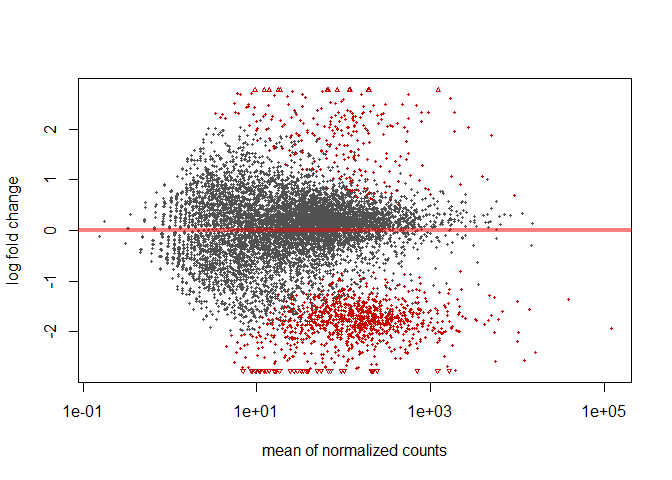
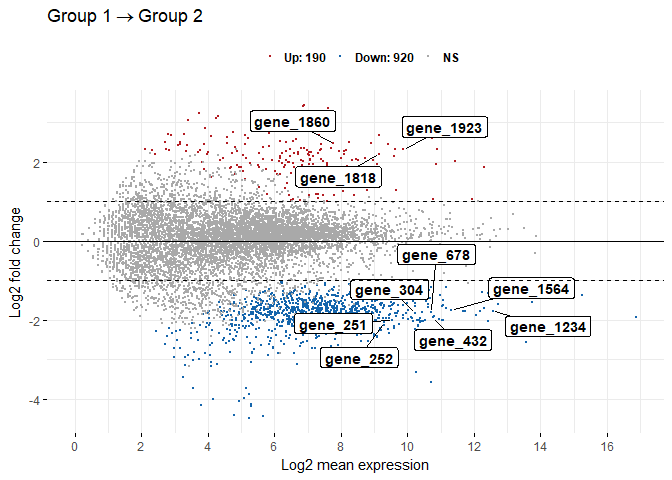
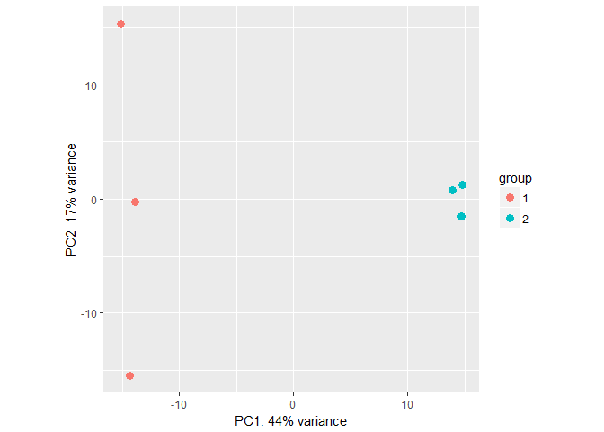

解析 | 発現変動 | 2群間 | 対応なし | 複製あり | DESeq2(Love\_2014)
================
Kadota, Su
2018年4月17日

リファレンス：[解析 | 発現変動 | 2群間 | 対応なし | 複製あり |
DESeq2(Love\_2014)](www.iu.a.u-tokyo.ac.jp/~kadota/r_seq.html#analysis_deg_2_unpaired_ari_DESeq2)

[DESeq2](http://bioconductor.org/packages/release/bioc/html/DESeq2.html)パッケージ
[(Love et al., Genome
Biol., 2014)](http://www.ncbi.nlm.nih.gov/pubmed/25516281)を用いるやり方を示します。
「ファイル」−「ディレクトリの変更」で解析したいファイルを置いてあるディレクトリに移動し以下をコピペ。

**サンプルデータ13の10,000 genes × 6
samplesの[カウントデータ](http://www.iu.a.u-tokyo.ac.jp/~kadota/R_seq/data_hypodata_3vs3.txt)の場合：**

Biological replicatesを模倣したシミュレーションデータ(G1群3サンプル vs. G2群3サンプル)です。
gene\_1〜gene\_2000までがDEG (最初の1800個がG1群で高発現、残りの200個がG2群で高発現)
gene\_2001〜gene\_10000までがnon-DEGであることが既知です。

### 0\. 必要なパッケージをロード

``` r
libs <- c("DESeq2", "knitr", "ggpubr", "dplyr", "caret")
for (i in libs){
  if( !is.element(i, .packages(all.available = TRUE)) ) {
    install.packages(i)
  }
  library(i,character.only = TRUE)
}
```

### 1\. 設置及びファイルの読み込み

``` r
in_f <- "http://www.iu.a.u-tokyo.ac.jp/~kadota/R_seq/data_hypodata_3vs3.txt"
# out_f1 <- "hoge1.txt"                  #出力ファイル名を指定してout_f1に格納
# out_f2 <- "hoge1.png"                  #出力ファイル名を指定してout_f2に格納
param_G1 <- 3                          #G1群のサンプル数を指定
param_G2 <- 3                          #G2群のサンプル数を指定
param_FDR <- 0.05                      #false discovery rate (FDR)閾値を指定
# param_fig <- c(400, 380)               #ファイル出力時の横幅と縦幅を指定(単位はピクセル)

#入力ファイルの読み込み
data <- read.table(in_f, 
                   header=TRUE, 
                   row.names=1, 
                   sep="\t", 
                   quote="")           #in_fで指定したファイルの読み込み

kable(head(data, n=10))
```

|          | G1\_rep1 | G1\_rep2 | G1\_rep3 | G2\_rep1 | G2\_rep2 | G2\_rep3 |
| -------- | -------: | -------: | -------: | -------: | -------: | -------: |
| gene\_1  |       36 |       56 |      144 |        2 |        1 |        0 |
| gene\_2  |       84 |      152 |      124 |       52 |       37 |       28 |
| gene\_3  |      592 |      840 |      800 |      151 |      257 |      200 |
| gene\_4  |        0 |        8 |        4 |        1 |        1 |        3 |
| gene\_5  |       32 |       32 |        0 |        1 |        1 |        0 |
| gene\_6  |        4 |        0 |       24 |        4 |       10 |        0 |
| gene\_7  |      344 |      240 |      236 |       76 |       67 |       71 |
| gene\_8  |     1264 |      784 |     1060 |      212 |      183 |      179 |
| gene\_9  |       92 |       88 |       84 |       21 |       22 |       33 |
| gene\_10 |       64 |       48 |       96 |       24 |       13 |       12 |

### 2\. 前処理

DESeqDataSetオブジェクトの作成

``` r
#G1群を1、G2群を2としたベクトルdata.clを作成
data.cl <- c(rep(1, param_G1), rep(2, param_G2))
data.cl
```

    ## [1] 1 1 1 2 2 2

``` r
#condition列にクラスラベル情報を格納したcolDataオブジェクトを作成
colData <- data.frame(condition=as.factor(data.cl))
kable(colData)
```

| condition |
| :-------- |
| 1         |
| 1         |
| 1         |
| 2         |
| 2         |
| 2         |

``` r
#DESeqDataSetオブジェクトdの作成
d <- DESeqDataSetFromMatrix(countData=data, colData=colData, design=~condition)
d
```

    ## class: DESeqDataSet 
    ## dim: 10000 6 
    ## metadata(1): version
    ## assays(1): counts
    ## rownames(10000): gene_1 gene_2 ... gene_9999 gene_10000
    ## rowData names(0):
    ## colnames(6): G1_rep1 G1_rep2 ... G2_rep2 G2_rep3
    ## colData names(1): condition

### 3\. 正規化

サンプルごとのSize Factorを計算して、正規化後のデータを必要であれば、 Normalized count = Original
count / size factor

``` r
sf <- estimateSizeFactors(d) #正規化を実行した結果をsfに格納
kable(sf@colData)
```

|          | condition | sizeFactor |
| -------- | :-------- | ---------: |
| G1\_rep1 | 1         |  1.0873234 |
| G1\_rep2 | 1         |  1.0743410 |
| G1\_rep3 | 1         |  1.0844426 |
| G2\_rep1 | 2         |  0.9500520 |
| G2\_rep2 | 2         |  0.9535996 |
| G2\_rep3 | 2         |  0.9518309 |

``` r
normalizedCounts <- t( t(counts(d)) / sizeFactors(sf) )
kable(head(normalizedCounts, n=10))
```

|          |    G1\_rep1 |   G1\_rep2 |   G1\_rep3 |   G2\_rep1 |   G2\_rep2 |  G2\_rep3 |
| -------- | ----------: | ---------: | ---------: | ---------: | ---------: | --------: |
| gene\_1  |   33.108826 |  52.124978 | 132.787111 |   2.105148 |   1.048658 |   0.00000 |
| gene\_2  |   77.253927 | 141.482083 | 114.344456 |  54.733846 |  38.800350 |  29.41699 |
| gene\_3  |  544.456244 | 781.874670 | 737.706170 | 158.938667 | 269.505135 | 210.12136 |
| gene\_4  |    0.000000 |   7.446425 |   3.688531 |   1.052574 |   1.048658 |   3.15182 |
| gene\_5  |   29.430067 |  29.785702 |   0.000000 |   1.052574 |   1.048658 |   0.00000 |
| gene\_6  |    3.678758 |   0.000000 |  22.131185 |   4.210296 |  10.486581 |   0.00000 |
| gene\_7  |  316.373223 | 223.392763 | 217.623320 |  79.995620 |  70.260093 |  74.59308 |
| gene\_8  | 1162.487656 | 729.749692 | 977.460676 | 223.145678 | 191.904434 | 188.05861 |
| gene\_9  |   84.611443 |  81.910680 |  77.459148 |  22.104053 |  23.070478 |  34.67002 |
| gene\_10 |   58.860135 |  44.678553 |  88.524740 |  25.261775 |  13.632555 |  12.60728 |

``` r
# dds <- estimateDispersions(sf) #モデル構築(ばらつきの程度を見積もっている)
# test <- nbinomLRT(dds, full= ~condition, reduced= ~1) #検定
```

### 4\. DEG検出

``` r
d <- DESeq(d)                          #DESeq2を実行
```

    ## estimating size factors

    ## estimating dispersions

    ## gene-wise dispersion estimates

    ## mean-dispersion relationship

    ## final dispersion estimates

    ## fitting model and testing

``` r
tmp <- results(d)                      #実行結果を抽出
kable(head(tmp, n=10))
```

|          |   baseMean | log2FoldChange |     lfcSE |        stat |    pvalue |      padj |
| -------- | ---------: | -------------: | --------: | ----------: | --------: | --------: |
| gene\_1  |  36.862453 |    \-4.4733173 | 0.7116498 | \-6.2858406 | 0.0000000 | 0.0000000 |
| gene\_2  |  76.005275 |    \-1.3500342 | 0.4103450 | \-3.2899978 | 0.0010019 | 0.0084053 |
| gene\_3  | 450.433707 |    \-1.6382684 | 0.3021862 | \-5.4213875 | 0.0000001 | 0.0000013 |
| gene\_4  |   2.731335 |    \-0.5330836 | 0.8580512 | \-0.6212725 | 0.5344204 |        NA |
| gene\_5  |  10.219500 |    \-2.2043272 | 0.8565114 | \-2.5736110 | 0.0100643 | 0.0660384 |
| gene\_6  |   6.751137 |    \-0.3713937 | 0.8552371 | \-0.4342582 | 0.6641009 | 0.9350289 |
| gene\_7  | 163.706350 |    \-1.6990169 | 0.2940805 | \-5.7773868 | 0.0000000 | 0.0000002 |
| gene\_8  | 578.801125 |    \-2.1935443 | 0.2693015 | \-8.1453096 | 0.0000000 | 0.0000000 |
| gene\_9  |  53.970971 |    \-1.5309951 | 0.3732560 | \-4.1017291 | 0.0000410 | 0.0004925 |
| gene\_10 |  40.594173 |    \-1.7261277 | 0.4923841 | \-3.5056528 | 0.0004555 | 0.0041267 |

``` r
summary(tmp)
```

    ## 
    ## out of 9941 with nonzero total read count
    ## adjusted p-value < 0.1
    ## LFC > 0 (up)     : 258, 2.6% 
    ## LFC < 0 (down)   : 1008, 10% 
    ## outliers [1]     : 123, 1.2% 
    ## low counts [2]   : 2108, 21% 
    ## (mean count < 3)
    ## [1] see 'cooksCutoff' argument of ?results
    ## [2] see 'independentFiltering' argument of ?results

``` r
p.value <- tmp$pvalue                  ##p-valueをp.valueに格納
p.value[is.na(p.value)] <- 1           #NAを1に置換している
q.value <- tmp$padj                    #adjusted p-valueをq.valueに格納
q.value[is.na(q.value)] <- 1           #NAを1に置換している

ranking <- rank(p.value)               #p.valueでランキングした結果をrankingに格納
sum(q.value < param_FDR)               #FDR閾値(q.value < param_FDR)を満たす遺伝子数を表示
```

    ## [1] 1131

``` r
sum(p.adjust(p.value, method="BH") < param_FDR) #FDR閾値(q.value < param_FDR)を満たす遺伝子数を表示(TCCはp-valueをもとにBH法でq-value情報を得ている)
```

    ## [1] 1089

### 5\. ファイルに保存(テキストファイル)

``` r
#入力データの右側にDEG検出結果を結合したものをtmpに格納
output <- cbind(gene_name=rownames(data), data, p.value, q.value, ranking)
kable(head(output, n=10))
```

|          | gene\_name | G1\_rep1 | G1\_rep2 | G1\_rep3 | G2\_rep1 | G2\_rep2 | G2\_rep3 |   p.value |   q.value | ranking |
| -------- | :--------- | -------: | -------: | -------: | -------: | -------: | -------: | --------: | --------: | ------: |
| gene\_1  | gene\_1    |       36 |       56 |      144 |        2 |        1 |        0 | 0.0000000 | 0.0000000 |     220 |
| gene\_2  | gene\_2    |       84 |      152 |      124 |       52 |       37 |       28 | 0.0010019 | 0.0084053 |     919 |
| gene\_3  | gene\_3    |      592 |      840 |      800 |      151 |      257 |      200 | 0.0000001 | 0.0000013 |     346 |
| gene\_4  | gene\_4    |        0 |        8 |        4 |        1 |        1 |        3 | 0.5344204 | 1.0000000 |    5362 |
| gene\_5  | gene\_5    |       32 |       32 |        0 |        1 |        1 |        0 | 0.0100643 | 0.0660384 |    1175 |
| gene\_6  | gene\_6    |        4 |        0 |       24 |        4 |       10 |        0 | 0.6641009 | 0.9350289 |    6562 |
| gene\_7  | gene\_7    |      344 |      240 |      236 |       76 |       67 |       71 | 0.0000000 | 0.0000002 |     297 |
| gene\_8  | gene\_8    |     1264 |      784 |     1060 |      212 |      183 |      179 | 0.0000000 | 0.0000000 |      64 |
| gene\_9  | gene\_9    |       92 |       88 |       84 |       21 |       22 |       33 | 0.0000410 | 0.0004925 |     642 |
| gene\_10 | gene\_10   |       64 |       48 |       96 |       24 |       13 |       12 | 0.0004555 | 0.0041267 |     851 |

``` r
#tmpの中身を指定したファイル名で保存
# write.table(tmp, out_f1, sep="\t", append=F, quote=F, row.names=F)
```

### 6\. M-A plot

``` r
# Method 1
plotMA(d) 
```

<!-- -->

``` r
# Method 2
ggmaplot(tmp, main = expression("Group 1" %->% "Group 2"),
   fdr = 0.05, fc = 2, size = 0.4,
   palette = c("#B31B21", "#1465AC", "darkgray"),
   genenames = as.vector(tmp$name),
   legend = "top", top = 10,
   font.label = c("bold", 11), label.rectangle = TRUE,
   font.legend = "bold",
   font.main = "bold",
   ggtheme = ggplot2::theme_minimal())
```

<!-- -->

### 7\. 主成分分析

``` r
rld <- rlog(d)
plotPCA(rld, intgroup=c("condition"))
```

<!-- -->

### 8\. AUC値（と ConfusionMatrix）を計算（Simulation Data Only）

AUC値とConfusionMatrixを計算する。

``` r
# ROCパッケージはCRANにいないため、インストールされていない場合は下記のコードを実行してインストールしてください。
# source("https://bioconductor.org/biocLite.R")
# biocLite("ROC")
library(ROC)
param_DEG <- 1:2000                    #DEGの位置を指定
obj <- rep(0, nrow(data))           #初期値として全てが0の(non-DEGに相当)ベクトルobjを作成
obj[param_DEG] <- 1                    #DEGの位置に1を代入
AUC(rocdemo.sca(truth=obj, data=-ranking))#AUC計算
```

    ## NA in cutpts forces recomputation using smallest gap

    ## [1] 0.8341681

``` r
deg_count <- sum(p.adjust(p.value, method="BH") < param_FDR)
prediction <- if_else(output$ranking <= deg_count, 1, 0)
confusionMatrix(prediction, obj)
```

    ## Confusion Matrix and Statistics
    ## 
    ##           Reference
    ## Prediction    0    1
    ##          0 7919  992
    ##          1   81 1008
    ##                                           
    ##                Accuracy : 0.8927          
    ##                  95% CI : (0.8865, 0.8987)
    ##     No Information Rate : 0.8             
    ##     P-Value [Acc > NIR] : < 2.2e-16       
    ##                                           
    ##                   Kappa : 0.5956          
    ##  Mcnemar's Test P-Value : < 2.2e-16       
    ##                                           
    ##             Sensitivity : 0.9899          
    ##             Specificity : 0.5040          
    ##          Pos Pred Value : 0.8887          
    ##          Neg Pred Value : 0.9256          
    ##              Prevalence : 0.8000          
    ##          Detection Rate : 0.7919          
    ##    Detection Prevalence : 0.8911          
    ##       Balanced Accuracy : 0.7469          
    ##                                           
    ##        'Positive' Class : 0               
    ## 

>   - [TCC](http://bioconductor.org/packages/release/bioc/html/TCC.html):
>     [Sun et al., BMC
>     Bioinformatics, 2013](http://www.ncbi.nlm.nih.gov/pubmed/23837715)
>   - [DESeq2](http://bioconductor.org/packages/release/bioc/html/DESeq2.html):
>     [Love et al., Genome
>     Biol., 2014](http://www.ncbi.nlm.nih.gov/pubmed/25516281)
