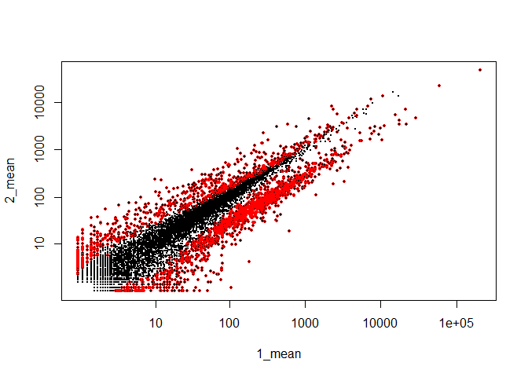
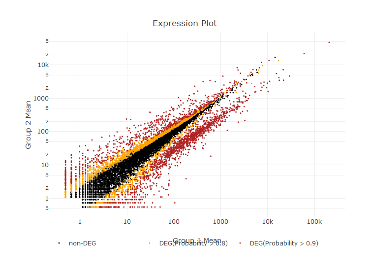
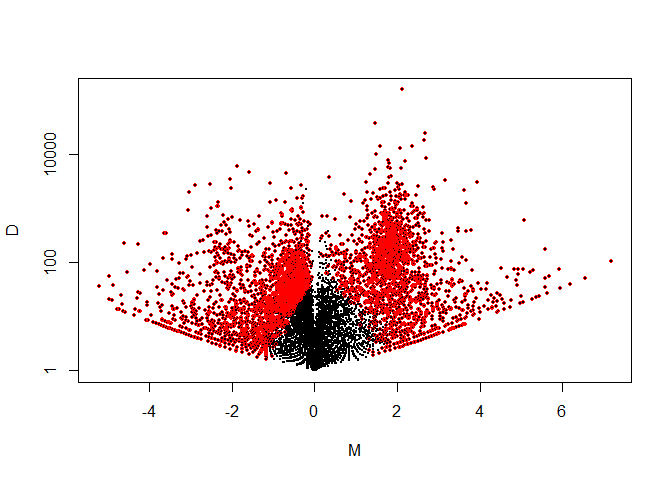
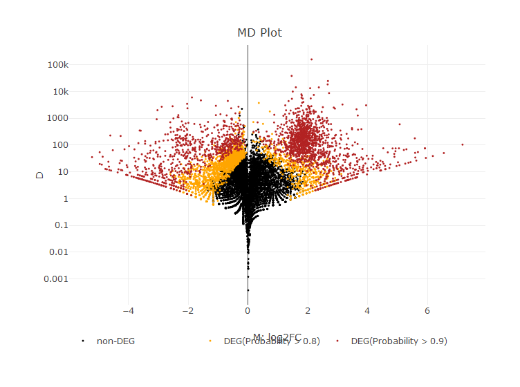

解析 | 発現変動 | 2群間 | 対応なし | 複製あり | NOISeq (Tarazona\_2011)
================
Kadota, Su
2018年5月4日

リファレンス：[解析 | 発現変動 | 2群間 | 対応なし | 複製あり | NOISeq
(Tarazona\_2011)](http://www.iu.a.u-tokyo.ac.jp/~kadota/r_seq.html#deg_NOISeq)

> NOISeq(参考文献1)のやり方を示します。二群間比較用です。  
> ここでは、以下の3つのデータセットに対するやり方を示します：  
> 1\. Technical replicatesデータ(G1群5サンプル vs. G2群5サンプル)  
> 2\. Biological replicatesデータ(G1群3サンプル vs. G2群3サンプル: data\_arab.txt)  
> 3\. Biological replicatesシミュレーションデータ(G1群3サンプル vs. G2群3サンプル:
> simdata\_3vs3.txt)  
> Technical
> replicatesのほうは、サンプルデータ2のSupplementaryTable2\_changed.txtのデータです。  
> Biological
> replicatesのほうは、NBPSeqパッケージに同梱されているArabidopsis(シロイヌナズナ)のデータ(サンプルデータ8のdata\_arab.txt)です。  
> この方法は負の二項分布（negative-binomial distribution；biological
> replicates用）やポアソン分布（Poisson distribution；technical
> replicates用）などの何らかの分布を仮定したパラメトリックな方法（edgeR, DESeq, baySeq, NBPSeq,
> GPseqなどが該当）とは異なり、ノンパラメトリックな方法です。  
> replicateがないデータ（G1群1サンプル vs. G2群1サンプル）場合には（technical
> replicatesを想定して?\!）noise
> distributionを作成し、replicatesがある場合には同一群内のデータを用いてnoise
> distributionを作成することでDEG or
> non-DEGの判定をするような仕組みになっています。  
> また、この方法は転写物の長さ情報も（RPKM補正後のデータを使いたい場合には）使います。マニュアル中にはここでは長さ情報がない場合には“NA”という情報を含むファイル（SupplementaryTable2\_changed\_length.txt）を入力として与えるという選択肢を提供していますが、私が2012/06/19に試した限りではうまく動きません。
> よって、以下では長さ情報を含むファイルを読み込まずに実行するやり方を示します。  
> 「ファイル」−「ディレクトリの変更」で解析したいファイルを置いてあるディレクトリに移動し以下をコピペ。

門田先生の`NOISeq`パッケージにつてのやり方がだいぶ古いので、2018/5/4に新しいやり方を自分で実装して見ました。使用したデータは門田先生が作ったシミュレーションデータ`data_hypodata_3vs3.txt`で、上記のテキストに説明したデータではない。

## 1\. サンプルデータ13の10,000 genes × 6 samplesの[カウントデータ](http://www.iu.a.u-tokyo.ac.jp/~kadota/R_seq/data_hypodata_3vs3.txt)の場合：

-----

Biological replicatesを模倣したシミュレーションデータ(G1群3サンプル vs. G2群3サンプル)です。
gene\_1〜gene\_2000までがDEG (最初の1800個がG1群で高発現、残りの200個がG2群で高発現)
gene\_2001〜gene\_10000までがnon-DEGであることが既知です。 Biological
replicatesデータと仮定し、正規化はTMMを採用する。

### 0\. 必要なパッケージをロード

``` r
libs <- c("knitr", "dplyr", "caret", "devtools", "plotly")
for (i in libs){
  if( !is.element(i, .packages(all.available = TRUE)) ) {
    install.packages(i)
  }
  library(i,character.only = TRUE)
}

# source("https://bioconductor.org/biocLite.R")
# biocLite("NOISeq")
library(NOISeq)
```

### 1\. 設置及びファイルの読み込み

``` r
in_f <- "http://www.iu.a.u-tokyo.ac.jp/~kadota/R_seq/data_hypodata_3vs3.txt"
# out_f1 <- "hoge1.txt"                  #出力ファイル名を指定してout_f1に格納
param_G1 <- 3                          #G1群のサンプル数を指定
param_G2 <- 3                          #G2群のサンプル数を指定
param_FDR <- 0.05                      #false discovery rate (FDR)閾値を指定

#入力ファイルの読み込み
data <- read.table(in_f, 
                   header=TRUE, 
                   row.names=1, 
                   sep="\t", 
                   quote="")           #in_fで指定したファイルの読み込み

kable(head(data, n=10))
```

|          | G1\_rep1 | G1\_rep2 | G1\_rep3 | G2\_rep1 | G2\_rep2 | G2\_rep3 |
| -------- | -------: | -------: | -------: | -------: | -------: | -------: |
| gene\_1  |       36 |       56 |      144 |        2 |        1 |        0 |
| gene\_2  |       84 |      152 |      124 |       52 |       37 |       28 |
| gene\_3  |      592 |      840 |      800 |      151 |      257 |      200 |
| gene\_4  |        0 |        8 |        4 |        1 |        1 |        3 |
| gene\_5  |       32 |       32 |        0 |        1 |        1 |        0 |
| gene\_6  |        4 |        0 |       24 |        4 |       10 |        0 |
| gene\_7  |      344 |      240 |      236 |       76 |       67 |       71 |
| gene\_8  |     1264 |      784 |     1060 |      212 |      183 |      179 |
| gene\_9  |       92 |       88 |       84 |       21 |       22 |       33 |
| gene\_10 |       64 |       48 |       96 |       24 |       13 |       12 |

### 2\. 前処理（NOISeqオブジェクト作成）

``` r
#G1群を1、G2群を2としたベクトルdata.clを作成
data.cl <- c(rep(1, param_G1), rep(2, param_G2))
myfactors <- data.frame("data.cl"=data.cl)
myfactors
```

    ##   data.cl
    ## 1       1
    ## 2       1
    ## 3       1
    ## 4       2
    ## 5       2
    ## 6       2

``` r
#NOISeqクラスオブジェクトを作成
mydata <- readData(data = data, factors = myfactors)
mydata
```

    ## ExpressionSet (storageMode: lockedEnvironment)
    ## assayData: 10000 features, 6 samples 
    ##   element names: exprs 
    ## protocolData: none
    ## phenoData
    ##   sampleNames: G1_rep1 G1_rep2 ... G2_rep3 (6 total)
    ##   varLabels: data.cl
    ##   varMetadata: labelDescription
    ## featureData: none
    ## experimentData: use 'experimentData(object)'
    ## Annotation:

### 3\. DEG検出

``` r
#DEG検出を実行した結果
mynoiseqbio <- noiseqbio(mydata, 
                         k = 0.5, 
                         norm = "tmm", 
                         factor = "data.cl",
                         lc = 1, 
                         r = 20, 
                         adj = 1.5, 
                         plot = FALSE, 
                         a0per = 0.9, 
                         random.seed = 12345,
                         filter = 1)
```

    ## Computing Z values...
    ## Filtering out low count features...
    ## 9601 features are to be kept for differential expression analysis with filtering method 1
    ## ...k-means clustering done
    ## Size of 15 clusters:
    ##  [1]   14   51    9 7682 1354    5    2    1    6   71  349    1   31   24
    ## [15]    1
    ## Resampling cluster...[1] 1
    ## [1] 2
    ## [1] 3
    ## [1] 4
    ## Size of 15 subclusters of cluster: 4
    ##  [1]  338 3337   53   24   92  242  162  390  719 1327   67  125  109  626
    ## [15]   71
    ## [1] 5
    ## Size of 15 subclusters of cluster: 5
    ##  [1] 157 158 110   5  57 369  21  49  29  98  11   1 117  44 128
    ## [1] 6
    ## [1] 7
    ## [1] 8
    ## [1] 9
    ## [1] 10
    ## [1] 11
    ## [1] 12
    ## [1] 13
    ## [1] 14
    ## [1] 15
    ## Computing Z for noise...
    ## Computing probability of differential expression...
    ## p0 = 0.34266285613644
    ## Probability
    ##    Min. 1st Qu.  Median    Mean 3rd Qu.    Max.    NA's 
    ##  0.0000  0.4652  0.7519  0.6508  0.8873  1.0000     399

``` r
kable(head(mynoiseqbio@results[[1]]))
```

|         |    1\_mean |     2\_mean |     theta |      prob |    log2FC |
| ------- | ---------: | ----------: | --------: | --------: | --------: |
| gene\_1 |  76.526890 |   1.2736160 | 1.8892978 | 0.9999997 | 5.9089645 |
| gene\_2 | 116.989443 |  42.6137942 | 0.9615427 | 0.9693089 | 1.4569859 |
| gene\_3 | 725.105095 | 221.7091696 | 2.4197774 | 1.0000000 | 1.7095217 |
| gene\_4 |   4.067508 |   1.8254175 | 0.2857730 | 0.6834072 | 1.1559188 |
| gene\_5 |  20.999337 |   0.9106026 | 1.2974485 | 0.9890011 | 4.5273784 |
| gene\_6 |   9.221054 |   5.2812796 | 0.1861113 | 0.5560866 | 0.8040441 |

### 4\. ファイルに保存(テキストファイル)

``` r
#入力データの右側にDEG検出結果を結合したものをtmpに格納
tmp <- mynoiseqbio@results[[1]]
tmp$ranking <- rank(1-tmp$prob)
#tmpの中身を指定したファイル名で保存
# write.table(tmp, out_f, sep="\t", append=F, quote=F, row.names=F)
```

### 5\. DEGを選択

``` r
# 全てのDEGを選択、DEGである可能性しきい値は0.8
deg_all <- degenes(mynoiseqbio, q = 0.8, M = NULL)
```

    ## [1] "4084 differentially expressed features"

``` r
# Up-regulatedのDEGを選択、DEGである可能性しきい値は0.8
deg_up <- degenes(mynoiseqbio, q = 0.8, M = "up")
```

    ## [1] "1901 differentially expressed features (up in first condition)"

``` r
# Down-regulatedのDEGを選択、DEGである可能性しきい値は0.8
deg_down <- degenes(mynoiseqbio, q = 0.8, M = "down")
```

    ## [1] "2183 differentially expressed features (down in first condition)"

### 6\. Expression plotとMDPlot

``` r
DE.plot(mynoiseqbio, q = 0.9, graphic = "expr", log.scale = TRUE)
```

<!-- -->

    ## [1] "2078 differentially expressed features"

``` r
# Plotlyを用いた方法
x <- cut(tmp$prob, breaks = c(0, 0.8, 0.9, 1))
#LegendのLevelをリネームする
levels(x) <- list("non-DEG"="(0,0.8]",
                  "DEG(Probability > 0.8)"="(0.8,0.9]",
                  "DEG(Probability > 0.9)"="(0.9,1]")  

plot_ly(data = tmp, 
        x = ~tmp[,1], 
        y = ~tmp[,2], 
        mode = "marker",
        type = "scatter",
        color = ~x,
        colors = c("#000000", "#FFA500", "#B22222"),
        marker = list(size = 3),
        hoverinfo = 'text',
        text = ~paste("</br>Gene: ", rownames(tmp),
                     "</br>Probability: ", paste((round(prob, 4) * 100), '%'),
                     "</br>log2(FoldChange): ", round(log2FC, 4))) %>%
  layout(xaxis = list(title = "Group 1 Mean", type = "log"),
         yaxis = list(title = "Group 2 Mean", type = "log"),
         title = "Expression Plot",
         legend = list(orientation = 'h'))
```

<!-- -->

``` r
DE.plot(mynoiseqbio, q = 0.8, graphic = "MD")
```

<!-- -->

    ## [1] "4084 differentially expressed features"

``` r
# Plotlyを用いた方法
x <- cut(tmp$prob, breaks = c(0, 0.8, 0.9, 1))
#LegendのLevelをリネームする
levels(x) <- list("non-DEG"="(0,0.8]",
                  "DEG(Probability > 0.8)"="(0.8,0.9]",
                  "DEG(Probability > 0.9)"="(0.9,1]")  

plot_ly(data = tmp,
        x = ~log2FC,
        y = ~abs(tmp[,1]-tmp[,2]),
        type = "scatter",
        mode = "marker",
        color = ~x,
        colors = c("#000000", "#FFA500", "#B22222"),
        marker = list(size = 3),
        hoverinfo = 'text',
        text = ~paste("</br>Gene: ", rownames(tmp),
                     "</br>Probability: ", paste((round(prob, 4) * 100), '%'),
                     "</br>log2(FoldChange): ", round(log2FC, 4))) %>%
  layout(xaxis = list(title = "M: log2FC"),
         yaxis = list(title = "D", type="log"),
         title = "MD Plot",
         legend = list(orientation = 'h'))
```

<!-- -->

### 7\. AUC値を計算（Simulation Data Only）

AUC値とConfusionMatrixを計算する。

``` r
# ROCパッケージはCRANにいないため、インストールされていない場合は下記のコードを実行してインストールしてください。
# source("https://bioconductor.org/biocLite.R")
# biocLite("ROC")
library(ROC)
param_DEG <- 1:2000                    #DEGの位置を指定
obj <- rep(0, nrow(data))           #初期値として全てが0の(non-DEGに相当)ベクトルobjを作成
obj[param_DEG] <- 1                    #DEGの位置に1を代入
AUC(rocdemo.sca(truth=obj, data=-tmp$ranking))#AUC計算
```

    ## [1] 0.8580292

``` r
param_prob <- 0.9
deg_count <- sum(tmp$prob > param_prob, na.rm = TRUE)
prediction <- if_else(tmp$ranking <= deg_count, 1, 0)
confusionMatrix(factor(prediction), factor(obj))
```

    ## Confusion Matrix and Statistics
    ## 
    ##           Reference
    ## Prediction    0    1
    ##          0 7275  647
    ##          1  725 1353
    ##                                           
    ##                Accuracy : 0.8628          
    ##                  95% CI : (0.8559, 0.8695)
    ##     No Information Rate : 0.8             
    ##     P-Value [Acc > NIR] : < 2e-16         
    ##                                           
    ##                   Kappa : 0.5774          
    ##  Mcnemar's Test P-Value : 0.03764         
    ##                                           
    ##             Sensitivity : 0.9094          
    ##             Specificity : 0.6765          
    ##          Pos Pred Value : 0.9183          
    ##          Neg Pred Value : 0.6511          
    ##              Prevalence : 0.8000          
    ##          Detection Rate : 0.7275          
    ##    Detection Prevalence : 0.7922          
    ##       Balanced Accuracy : 0.7929          
    ##                                           
    ##        'Positive' Class : 0               
    ## 

-----

>   - [NOISeqのwebページ](http://bioinfo.cipf.es/noiseq)
>   - [NOISeq](http://bioconductor.org/packages/release/bioc/html/NOISeq.html):
>     [Tarazona et al., Genome
>     Res., 2011](http://www.ncbi.nlm.nih.gov/pubmed/21903743)
