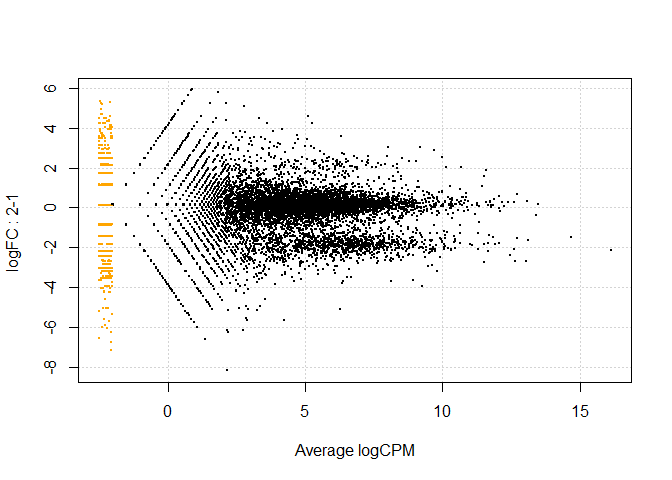
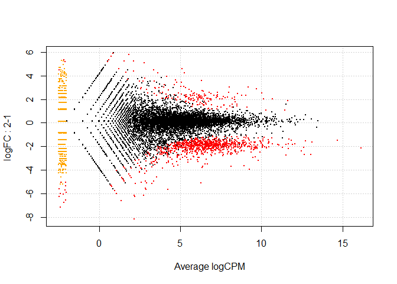
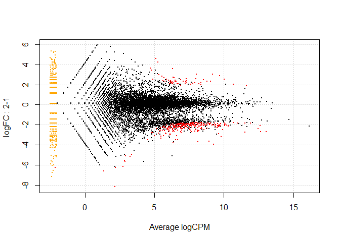
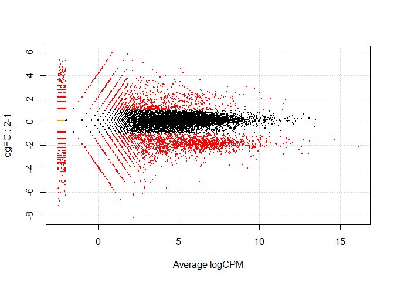
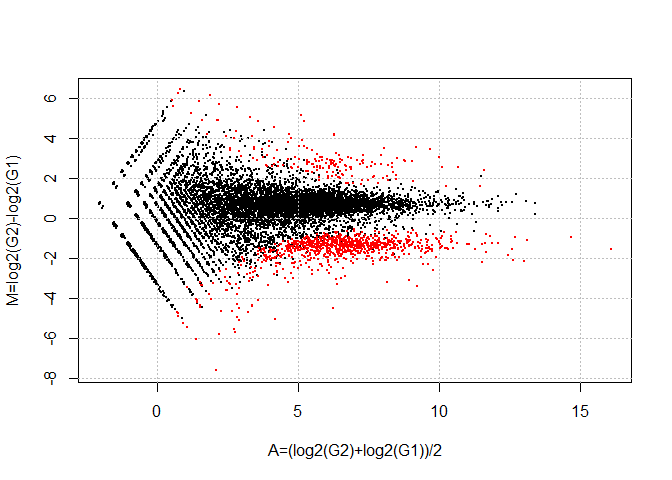
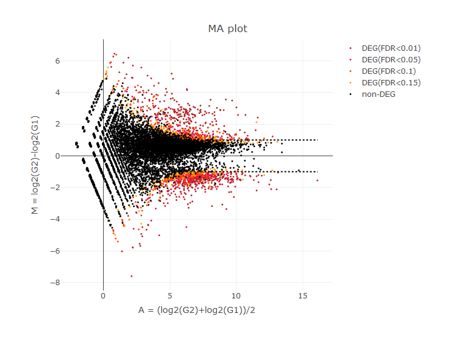

解析 | 発現変動 | 2群間 | 対応なし | 複製あり | edgeR(Robinson\_2010)
================
Kadota, Su
2018年5月3日

リファレンス：[解析 | 発現変動 | 2群間 | 対応なし | 複製あり |
edgeR(Robinson\_2010)](www.iu.a.u-tokyo.ac.jp/~kadota/r_seq.html#analysis_deg_2_unpaired_ari_edgeR)

[edgeR](http://bioconductor.org/packages/release/bioc/html/edgeR.html)パッケージを用いて発現変動遺伝子(Differentially
expressed Genes; DEGs)検出を行うやり方を示します。
「ファイル」−「ディレクトリの変更」で解析したいファイルを置いてあるディレクトリに移動し以下をコピペ。

## 1\. サンプルデータ13の10,000 genes × 6 samplesの[カウントデータ](http://www.iu.a.u-tokyo.ac.jp/~kadota/R_seq/data_hypodata_3vs3.txt)の場合：

-----

Biological replicatesを模倣したシミュレーションデータ(G1群3サンプル vs. G2群3サンプル)です。
gene\_1〜gene\_2000までがDEG (最初の1800個がG1群で高発現、残りの200個がG2群で高発現)
gene\_2001〜gene\_10000までがnon-DEGであることが既知です。

### 0\. 必要なパッケージをロード

``` r
libs <- c("knitr", "dplyr", "caret", "devtools", "plotly", "edgeR")
for (i in libs){
  if( !is.element(i, .packages(all.available = TRUE)) ) {
    install.packages(i)
  }
  library(i,character.only = TRUE)
}
```

### 1\. 設置及びファイルの読み込み

``` r
in_f <- "http://www.iu.a.u-tokyo.ac.jp/~kadota/R_seq/data_hypodata_3vs3.txt"
# out_f1 <- "hoge1.txt"                  #出力ファイル名を指定してout_f1に格納
param_G1 <- 3                          #G1群のサンプル数を指定
param_G2 <- 3                          #G2群のサンプル数を指定
param_FDR <- 0.05                      #false discovery rate (FDR)閾値を指定

#入力ファイルの読み込み
data <- read.table(in_f, 
                   header=TRUE, 
                   row.names=1, 
                   sep="\t", 
                   quote="")           #in_fで指定したファイルの読み込み

kable(head(data, n=10))
```

|          | G1\_rep1 | G1\_rep2 | G1\_rep3 | G2\_rep1 | G2\_rep2 | G2\_rep3 |
| -------- | -------: | -------: | -------: | -------: | -------: | -------: |
| gene\_1  |       36 |       56 |      144 |        2 |        1 |        0 |
| gene\_2  |       84 |      152 |      124 |       52 |       37 |       28 |
| gene\_3  |      592 |      840 |      800 |      151 |      257 |      200 |
| gene\_4  |        0 |        8 |        4 |        1 |        1 |        3 |
| gene\_5  |       32 |       32 |        0 |        1 |        1 |        0 |
| gene\_6  |        4 |        0 |       24 |        4 |       10 |        0 |
| gene\_7  |      344 |      240 |      236 |       76 |       67 |       71 |
| gene\_8  |     1264 |      784 |     1060 |      212 |      183 |      179 |
| gene\_9  |       92 |       88 |       84 |       21 |       22 |       33 |
| gene\_10 |       64 |       48 |       96 |       24 |       13 |       12 |

### 2\. ラベル情報の作成

``` r
#G1群を1、G2群を2としたベクトルdata.clを作成
data.cl <- c(rep(1, param_G1), rep(2, param_G2))
data.cl
```

    ## [1] 1 1 1 2 2 2

### 3\. DEG検出

``` r
#DGEListオブジェクトを作成してdに格納
d <- DGEList(counts=data,group=data.cl)
d
```

    ## An object of class "DGEList"
    ## $counts
    ##        G1_rep1 G1_rep2 G1_rep3 G2_rep1 G2_rep2 G2_rep3
    ## gene_1      36      56     144       2       1       0
    ## gene_2      84     152     124      52      37      28
    ## gene_3     592     840     800     151     257     200
    ## gene_4       0       8       4       1       1       3
    ## gene_5      32      32       0       1       1       0
    ## 9995 more rows ...
    ## 
    ## $samples
    ##         group lib.size norm.factors
    ## G1_rep1     1  1762346            1
    ## G1_rep2     1  1561258            1
    ## G1_rep3     1  1818047            1
    ## G2_rep1     2  1023545            1
    ## G2_rep2     2  1075566            1
    ## G2_rep3     2  1028008            1

``` r
#TMM正規化を実行
d <- calcNormFactors(d)
d
```

    ## An object of class "DGEList"
    ## $counts
    ##        G1_rep1 G1_rep2 G1_rep3 G2_rep1 G2_rep2 G2_rep3
    ## gene_1      36      56     144       2       1       0
    ## gene_2      84     152     124      52      37      28
    ## gene_3     592     840     800     151     257     200
    ## gene_4       0       8       4       1       1       3
    ## gene_5      32      32       0       1       1       0
    ## 9995 more rows ...
    ## 
    ## $samples
    ##         group lib.size norm.factors
    ## G1_rep1     1  1762346    0.8001215
    ## G1_rep2     1  1561258    0.8983822
    ## G1_rep3     1  1818047    0.7750773
    ## G2_rep1     2  1023545    1.2437335
    ## G2_rep2     2  1075566    1.1707409
    ## G2_rep3     2  1028008    1.2326783

``` r
#the quantile-adjusted conditional maximum likelihood (qCML)法でcommon dispersionを計算している
d <- estimateCommonDisp(d)
d
```

    ## An object of class "DGEList"
    ## $counts
    ##        G1_rep1 G1_rep2 G1_rep3 G2_rep1 G2_rep2 G2_rep3
    ## gene_1      36      56     144       2       1       0
    ## gene_2      84     152     124      52      37      28
    ## gene_3     592     840     800     151     257     200
    ## gene_4       0       8       4       1       1       3
    ## gene_5      32      32       0       1       1       0
    ## 9995 more rows ...
    ## 
    ## $samples
    ##         group lib.size norm.factors
    ## G1_rep1     1  1762346    0.8001215
    ## G1_rep2     1  1561258    0.8983822
    ## G1_rep3     1  1818047    0.7750773
    ## G2_rep1     2  1023545    1.2437335
    ## G2_rep2     2  1075566    1.1707409
    ## G2_rep3     2  1028008    1.2326783
    ## 
    ## $common.dispersion
    ## [1] 0.2963347
    ## 
    ## $pseudo.counts
    ##          G1_rep1    G1_rep2    G1_rep3    G2_rep1    G2_rep2      G2_rep3
    ## gene_1  34.03955  53.276819 136.497659   2.082380   1.065233 1.042459e-02
    ## gene_2  79.49899 144.692416 117.476232  54.511204  39.236584 2.952430e+01
    ## gene_3 560.45791 799.525393 757.924929 158.377052 272.448432 2.107080e+02
    ## gene_4   0.00000   7.657709   3.784944   1.061961   1.076374 3.140337e+00
    ## gene_5  30.33164  30.490533   0.000000   1.046619   1.057399 7.531829e-03
    ## 9995 more rows ...
    ## 
    ## $pseudo.lib.size
    ## [1] 1335012
    ## 
    ## $AveLogCPM
    ## [1] 4.904247 5.897196 8.434885 1.845300 3.236426
    ## 9995 more elements ...

``` r
#the quantile-adjusted conditional maximum likelihood (qCML)法でmoderated tagwise dispersionを計算している
d <- estimateTagwiseDisp(d)
d
```

    ## An object of class "DGEList"
    ## $counts
    ##        G1_rep1 G1_rep2 G1_rep3 G2_rep1 G2_rep2 G2_rep3
    ## gene_1      36      56     144       2       1       0
    ## gene_2      84     152     124      52      37      28
    ## gene_3     592     840     800     151     257     200
    ## gene_4       0       8       4       1       1       3
    ## gene_5      32      32       0       1       1       0
    ## 9995 more rows ...
    ## 
    ## $samples
    ##         group lib.size norm.factors
    ## G1_rep1     1  1762346    0.8001215
    ## G1_rep2     1  1561258    0.8983822
    ## G1_rep3     1  1818047    0.7750773
    ## G2_rep1     2  1023545    1.2437335
    ## G2_rep2     2  1075566    1.1707409
    ## G2_rep3     2  1028008    1.2326783
    ## 
    ## $common.dispersion
    ## [1] 0.2963347
    ## 
    ## $pseudo.counts
    ##          G1_rep1    G1_rep2    G1_rep3    G2_rep1    G2_rep2      G2_rep3
    ## gene_1  34.03955  53.276819 136.497659   2.082380   1.065233 1.042459e-02
    ## gene_2  79.49899 144.692416 117.476232  54.511204  39.236584 2.952430e+01
    ## gene_3 560.45791 799.525393 757.924929 158.377052 272.448432 2.107080e+02
    ## gene_4   0.00000   7.657709   3.784944   1.061961   1.076374 3.140337e+00
    ## gene_5  30.33164  30.490533   0.000000   1.046619   1.057399 7.531829e-03
    ## 9995 more rows ...
    ## 
    ## $pseudo.lib.size
    ## [1] 1335012
    ## 
    ## $AveLogCPM
    ## [1] 4.904247 5.897196 8.434885 1.845300 3.236426
    ## 9995 more elements ...
    ## 
    ## $prior.df
    ## [1] 10
    ## 
    ## $prior.n
    ## [1] 2.5
    ## 
    ## $tagwise.dispersion
    ## [1] 0.3041561 0.1346346 0.1014676 1.0638615 0.9875577
    ## 9995 more elements ...
    ## 
    ## $span
    ## [1] 0.3

``` r
#exact test (正確確率検定)で発現変動遺伝子を計算した結果をoutに格納
out <- exactTest(d)                    
out
```

    ## An object of class "DGEExact"
    ## $table
    ##            logFC   logCPM       PValue
    ## gene_1 -5.986605 4.904247 3.192886e-10
    ## gene_2 -1.467993 5.897196 1.679669e-03
    ## gene_3 -1.722541 8.434885 1.155560e-05
    ## gene_4 -1.060833 1.845300 5.345429e-01
    ## gene_5 -4.621650 3.236426 3.617504e-03
    ## 9995 more rows ...
    ## 
    ## $comparison
    ## [1] "1" "2"
    ## 
    ## $genes
    ## NULL

``` r
#検定結果を抽出
tmp <- topTags(out, n=nrow(data), sort.by="none")
kable(head(tmp$table))
```

|         |       logFC |   logCPM |    PValue |       FDR |
| ------- | ----------: | -------: | --------: | --------: |
| gene\_1 | \-5.9866046 | 4.904247 | 0.0000000 | 0.0000002 |
| gene\_2 | \-1.4679926 | 5.897196 | 0.0016797 | 0.0175331 |
| gene\_3 | \-1.7225410 | 8.434885 | 0.0000116 | 0.0002523 |
| gene\_4 | \-1.0608328 | 1.845300 | 0.5345429 | 1.0000000 |
| gene\_5 | \-4.6216500 | 3.236426 | 0.0036175 | 0.0347837 |
| gene\_6 | \-0.8268589 | 2.738935 | 0.6168762 | 1.0000000 |

``` r
p.value <- tmp$table$PValue        #p値をp.valueに格納
q.value <- tmp$table$FDR           #q値をq.valueに格納
ranking <- rank(p.value)           #p.valueでランキングした結果をrankingに格納
sum(q.value < param_FDR)           #FDR閾値(q.value < param_FDR)を満たす遺伝子数を表示
```

    ## [1] 1097

### 4\. ファイルに保存(テキストファイル)

``` r
#入力データの右側にp.value、q.value、rankingを結合した結果をtmpに格納
tmp <- cbind(rownames(data), data, p.value, q.value, ranking)
#tmpの中身を指定したファイル名で保存
# write.table(tmp, out_f, sep="\t", append=F, quote=F, row.names=F)
```

### 5\. MA-Plot

``` r
#MA-plotを描画
#MA-plotの基本形（縦軸(M)：log-ratio, 横軸(A)：全体的な発現レベル）
plotSmear(d)                           
```

<!-- -->

``` r
# MA-plotも描き、FDR < 0.05を満たすものを赤色で示すやり方です。
#指定したFDRの閾値を満たす遺伝子名情報をhogeに格納
hoge <- rownames(data)[q.value < param_FDR]
#MA-plotの基本形に加え、発現変動遺伝子に相当する
plotSmear(d, de.tags=hoge)    
```

<!-- -->

``` r
# MA-plotも描き、FDR値で発現変動順に並べた上位300個を赤色で示すやり方です。
#MA-plot描画時の赤色で示す上位遺伝子数の閾値を指定
param3 <- 300                          
#param3で指定した個数の上位遺伝子の遺伝子名情報をhogeに格納
hoge <- rownames(data)[ranking <= param3]
#MA-plotの基本形に加え、発現変動遺伝子に相当する
plotSmear(d, de.tags=hoge)    
```

<!-- -->

``` r
# MA-plotも描き、2倍以上発現変化しているものを赤色で示すやり方です。
#MA-plot描画時の倍率変化の閾値を指定
param3 <- 2     
#param3で指定した倍率変化の閾値を満たす遺伝子名情報をhogeに格納
hoge <- rownames(data)[abs(out$table$logFC) >= log2(param3)]
#MA-plotの基本形に加え、発現変動遺伝子に相当する
plotSmear(d, de.tags=hoge)             
```

<!-- -->

### 5.1 RPM正規化後のデータでM-A plotを描画

``` r
norm_f_RPM <- 1000000/colSums(data)    #各列に対して掛ける正規化係数を計算してnorm_f_RPMに格納
norm_f_RPM
```

    ##   G1_rep1   G1_rep2   G1_rep3   G2_rep1   G2_rep2   G2_rep3 
    ## 0.5674255 0.6405091 0.5500408 0.9769966 0.9297430 0.9727551

``` r
RPM <- sweep(data, 2, norm_f_RPM, "*") #norm_f_RPMを各列に掛けた結果をRPMに格納
data <- RPM                            #RPMをdataに格納
kable(head(data))
```

|         |   G1\_rep1 |   G1\_rep2 |   G1\_rep3 |    G2\_rep1 |   G2\_rep2 |   G2\_rep3 |
| ------- | ---------: | ---------: | ---------: | ----------: | ---------: | ---------: |
| gene\_1 |  20.427317 |  35.868511 |  79.205873 |   1.9539932 |   0.929743 |   0.000000 |
| gene\_2 |  47.663739 |  97.357387 |  68.205057 |  50.8038240 |  34.400492 |  27.237142 |
| gene\_3 | 335.915876 | 538.027667 | 440.032628 | 147.5264888 | 238.943961 | 194.551015 |
| gene\_4 |   0.000000 |   5.124073 |   2.200163 |   0.9769966 |   0.929743 |   2.918265 |
| gene\_5 |  18.157615 |  20.496292 |   0.000000 |   0.9769966 |   0.929743 |   0.000000 |
| gene\_6 |   2.269702 |   0.000000 |  13.200979 |   3.9079865 |   9.297430 |   0.000000 |

``` r
#遺伝子ごとにG1群の平均の対数を計算した結果をmean_G1に格納
mean_G1 <- log2(apply(as.matrix(data[,data.cl==1]), 1, mean))
#遺伝子ごとにG2群の平均の対数を計算した結果をmean_G2に格納
mean_G2 <- log2(apply(as.matrix(data[,data.cl==2]), 1, mean))

#「G1群の平均値」と「G2群の平均値」の平均をとったものがM-A plotのA(x軸の値)に相当するものなのでx_axisに格納)
x_axis <- (mean_G1 + mean_G2)/2 
#いわゆるlog比(logの世界での引き算)がM-A plotのM(y軸の値)に相当するものなのでy_axisに格納)
y_axis <- mean_G2 - mean_G1 
#指定した閾値未満のものの位置情報をDEG_posiに格納
DEG_posi <- (q.value < param_FDR)      

#MA-plotを描画（本番）
# Method 1
plot(x_axis, 
     y_axis, 
     xlab="A=(log2(G2)+log2(G1))/2", 
     ylab="M=log2(G2)-log2(G1)", 
     pch=20, cex=.1)

grid(col="gray", lty="dotted")         #指定したパラメータでグリッドを表示

points(x_axis[DEG_posi], 
       y_axis[DEG_posi], 
       col="red", 
       pch=20, cex=0.1)                #DEGを赤色にしている
```

<!-- -->

``` r
# Method 2
set <- DGEList(counts=data,group=data.cl)
#RPM正規化を実行しましたので、今回は正規化しないを設定する
set <- calcNormFactors(set, method="none")
set <- estimateCommonDisp(set)             
set <- estimateTagwiseDisp(set)
out <- exactTest(set)
q.value <- p.adjust(out$table$PValue, method="BH")
rpm_df <- data.frame("gene_id"=names(x_axis),
                     "a.value"=x_axis, 
                     "m.value"=y_axis, 
                     "p.value"=out$table$PValue,
                     "q.value"=q.value)
kable(head(rpm_df))
```

|         | gene\_id |   a.value |     m.value |   p.value |   q.value |
| ------- | :------- | --------: | ----------: | --------: | --------: |
| gene\_1 | gene\_1  | 2.7200907 | \-5.5542279 | 0.0000000 | 0.0000040 |
| gene\_2 | gene\_2  | 5.6896730 | \-0.9232105 | 0.0534119 | 0.2225495 |
| gene\_3 | gene\_3  | 8.1861230 | \-1.1772757 | 0.0023966 | 0.0332054 |
| gene\_4 | gene\_4  | 0.9866419 | \-0.6021479 | 0.8666938 | 1.0000000 |
| gene\_5 | gene\_5  | 1.5168626 | \-4.3414345 | 0.0096409 | 0.0817107 |
| gene\_6 | gene\_6  | 2.2522989 | \-0.2284068 | 0.9452778 | 1.0000000 |

``` r
#MA-plot描画時の倍率変化の閾値を指定
param_FC <- 2
x <- cut(rpm_df$q.value, breaks = c(0, 0.01, 0.05, 0.1, 0.15, 1))
levels(x) <- list("DEG(FDR<0.01)"="(0,0.01]",
                  "DEG(FDR<0.05)"="(0.01,0.05]",
                  "DEG(FDR<0.1)"="(0.05,0.1]",
                  "DEG(FDR<0.15)"="(0.1,0.15]",
                  "non-DEG"="(0.15,1]")  #LegendのLevelをリネームする

plot_ly(data = rpm_df, 
        x = ~a.value, 
        y = ~m.value, 
        mode = "marker",
        type = "scatter",
        color = ~x,
        colors = c("#B22222", "#DC143C", "#FF4500", "#FFA500", "#000000"),
        marker = list(size = 3),
        hoverinfo = 'text',
        text = ~paste("</br>Gene: ", gene_id,
                     "</br>p-value: ", round(p.value, 4),
                     "</br>q-value: ", round(q.value, 4))) %>%
  layout(xaxis = list(title = "A = (log2(G2)+log2(G1))/2"),
         yaxis = list(title = "M = log2(G2)-log2(G1)"),
         title = "MA plot",
         shapes= list(list(type='line', 
                           y0= log2(param_FC),
                           y1= log2(param_FC), 
                           x0=~min(a.value), 
                           x1=~max(a.value),
                           line=list(dash='dot', width=2)),
                      list(type='line', 
                           y0= -log2(param_FC),
                           y1= -log2(param_FC), 
                           x0=~min(a.value), 
                           x1=~max(a.value),
                           line=list(dash='dot', width=2))))
```

<!-- -->

### 5.2 TMM正規化後のデータでM-A plotを描画

``` r
data <- read.table(in_f, 
                   header=TRUE, 
                   row.names=1, 
                   sep="\t", 
                   quote="")           #in_fで指定したファイルの読み込み

set_ <- DGEList(counts=data,group=data.cl)#DGEListオブジェクトを作成してdに格納
set_ <- calcNormFactors(set_)                #TMM正規化係数を計算
set_ <- estimateCommonDisp(set_)             
set_ <- estimateTagwiseDisp(set_)
out <- exactTest(set_)
q.value <- p.adjust(out$table$PValue, method="BH")

data <- cpm(set_)
kable(head(data))
```

|         |   G1\_rep1 |   G1\_rep2 |   G1\_rep3 |    G2\_rep1 |    G2\_rep2 |   G2\_rep3 |
| ------- | ---------: | ---------: | ---------: | ----------: | ----------: | ---------: |
| gene\_1 |  25.530270 |  39.925668 | 102.190930 |   1.5710706 |   0.7941493 |   0.000000 |
| gene\_2 |  59.570629 | 108.369671 |  87.997745 |  40.8478360 |  29.3835228 |  22.095905 |
| gene\_3 | 419.831101 | 598.885022 | 567.727390 | 118.6158314 | 204.0963613 | 157.827893 |
| gene\_4 |   0.000000 |   5.703667 |   2.838637 |   0.7855353 |   0.7941493 |   2.367418 |
| gene\_5 |  22.693573 |  22.814667 |   0.000000 |   0.7855353 |   0.7941493 |   0.000000 |
| gene\_6 |   2.836697 |   0.000000 |  17.031822 |   3.1421412 |   7.9414927 |   0.000000 |

``` r
#遺伝子ごとにG1群の平均の対数を計算した結果をmean_G1に格納
mean_G1 <- log2(apply(as.matrix(data[,data.cl==1]), 1, mean))
#遺伝子ごとにG2群の平均の対数を計算した結果をmean_G2に格納
mean_G2 <- log2(apply(as.matrix(data[,data.cl==2]), 1, mean))

#「G1群の平均値」と「G2群の平均値」の平均をとったものがM-A plotのA(x軸の値)に相当するものなのでx_axisに格納)
x_axis <- (mean_G1 + mean_G2)/2 
#いわゆるlog比(logの世界での引き算)がM-A plotのM(y軸の値)に相当するものなのでy_axisに格納)
y_axis <- mean_G2 - mean_G1 

tmm_df <- data.frame("gene_id"=names(x_axis),
                     "a.value"=x_axis, 
                     "m.value"=y_axis, 
                     "p.value"=out$table$PValue,
                     "q.value"=q.value)
kable(head(tmm_df))
```

|         | gene\_id |   a.value |     m.value |   p.value |   q.value |
| ------- | :------- | --------: | ----------: | --------: | --------: |
| gene\_1 | gene\_1  | 2.7306655 | \-6.1473074 | 0.0000000 | 0.0000002 |
| gene\_2 | gene\_2  | 5.6792053 | \-1.4709660 | 0.0016797 | 0.0175331 |
| gene\_3 | gene\_3  | 8.1850842 | \-1.7230675 | 0.0000116 | 0.0002523 |
| gene\_4 | gene\_4  | 0.9527472 | \-1.1138311 | 0.5345429 | 1.0000000 |
| gene\_5 | gene\_5  | 1.4988837 | \-4.8484194 | 0.0036175 | 0.0347837 |
| gene\_6 | gene\_6  | 2.3064232 | \-0.8420533 | 0.6168762 | 1.0000000 |

``` r
#MA-plot描画時の倍率変化の閾値を指定
param_FC <- 2
x <- cut(rpm_df$q.value, breaks = c(0, 0.01, 0.05, 0.1, 0.15, 1))
levels(x) <- list("DEG(FDR<0.01)"="(0,0.01]",
                  "DEG(FDR<0.05)"="(0.01,0.05]",
                  "DEG(FDR<0.1)"="(0.05,0.1]",
                  "DEG(FDR<0.15)"="(0.1,0.15]",
                  "non-DEG"="(0.15,1]")  #LegendのLevelをリネームする

plot_ly(data = tmm_df, 
        x = ~a.value, 
        y = ~m.value, 
        mode = "marker",
        type = "scatter",
        color = ~x,
        colors = c("#B22222", "#DC143C", "#FF4500", "#FFA500", "#000000"),
        marker = list(size = 3),
        hoverinfo = 'text',
        text = ~paste("</br>Gene: ", gene_id,
                     "</br>p-value: ", round(p.value, 4),
                     "</br>q-value: ", round(q.value, 4))) %>%
  layout(xaxis = list(title = "A = (log2(G2)+log2(G1))/2"),
         yaxis = list(title = "M = log2(G2)-log2(G1)"),
         title = "MA plot",
         shapes= list(list(type='line', 
                           y0= log2(param_FC),
                           y1= log2(param_FC), 
                           x0=~min(a.value), 
                           x1=~max(a.value),
                           line=list(dash='dot', width=2)),
                      list(type='line', 
                           y0= -log2(param_FC),
                           y1= -log2(param_FC), 
                           x0=~min(a.value), 
                           x1=~max(a.value),
                           line=list(dash='dot', width=2))))
```

<!-- -->

### 6\. AUC値（と ConfusionMatrix）を計算（Simulation Data Only）

AUC値とConfusionMatrixを計算する。

``` r
# ROCパッケージはCRANにいないため、インストールされていない場合は下記のコードを実行してインストールしてください。
# source("https://bioconductor.org/biocLite.R")
# biocLite("ROC")
library(ROC)
param_DEG <- 1:2000                    #DEGの位置を指定
obj <- rep(0, nrow(data))           #初期値として全てが0の(non-DEGに相当)ベクトルobjを作成
obj[param_DEG] <- 1                    #DEGの位置に1を代入
AUC(rocdemo.sca(truth=obj, data=-ranking))#AUC計算
```

    ## [1] 0.8757175

``` r
param_FDR <- 0.1
deg_count <- sum(q.value < param_FDR)
prediction <- if_else(ranking <= deg_count, 1, 0)
confusionMatrix(prediction, obj)
```

    ## Confusion Matrix and Statistics
    ## 
    ##           Reference
    ## Prediction    0    1
    ##          0 7885  877
    ##          1  115 1123
    ##                                           
    ##                Accuracy : 0.9008          
    ##                  95% CI : (0.8948, 0.9066)
    ##     No Information Rate : 0.8             
    ##     P-Value [Acc > NIR] : < 2.2e-16       
    ##                                           
    ##                   Kappa : 0.6383          
    ##  Mcnemar's Test P-Value : < 2.2e-16       
    ##                                           
    ##             Sensitivity : 0.9856          
    ##             Specificity : 0.5615          
    ##          Pos Pred Value : 0.8999          
    ##          Neg Pred Value : 0.9071          
    ##              Prevalence : 0.8000          
    ##          Detection Rate : 0.7885          
    ##    Detection Prevalence : 0.8762          
    ##       Balanced Accuracy : 0.7736          
    ##                                           
    ##        'Positive' Class : 0               
    ## 

-----

>   - [edgeR](http://bioconductor.org/packages/release/bioc/html/edgeR.html)：[Robinson
>     et al.,
>     Bioinformatics, 2010](http://www.ncbi.nlm.nih.gov/pubmed/19910308)
>   - [TMM正規化法](http://bioinf.wehi.edu.au/folders/tmm_rnaseq/TMM.html):
>     [Robinson and Oshlack, Genome
>     Biol., 2010](http://www.ncbi.nlm.nih.gov/pubmed/20196867)
>   - An exact test for negative binomial distribution: [Robinson and
>     Smyth,
>     Biostatistics, 2008](http://www.ncbi.nlm.nih.gov/pubmed/17728317)
>   - [Robinson and Smyth, Bioinformatics,
>     2007](Robinson%20and%20Smyth,%20Bioinformatics,%202007)
>   - [McCarthy et al., Nucleic Acids
>     Res., 2012](http://www.ncbi.nlm.nih.gov/pubmed/22287627)
>   - edgeRをstem cell biologyに適用したという論文(QuasRを引用している)：[Nikolayeva and
>     Robinson, Methods Mol
>     Biol., 2014](http://www.ncbi.nlm.nih.gov/pubmed/24743990)
